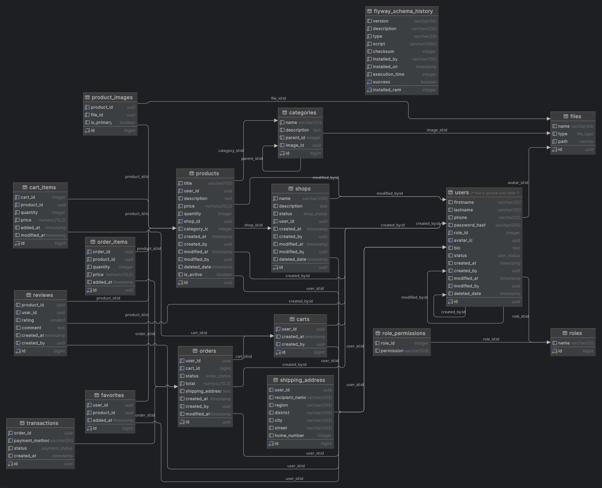

## 📦 Sendiy Marketplace

Sendiy is a modern online marketplace where users can buy and sell unique products.

This project follows **Hexagonal Architecture (Ports & Adapters)** using **Spring Boot** to keep business logic isolated and maintainable.

---

## ⚙️ Tech Stack

- **Java 17+**
- **Spring Boot**
- **Gradle** (multi-module)
- **PostgreSQL** (ERD included)
- **JOOQ**
- **Flyway** for schema versioning
- **Hexagonal Architecture**

---

## 🗂️ Project Structure

```
sendiy/
 ├── adapter/           # Adapters: HTTP controllers, database access (repositories)
 ├── application/       # Application core: services, use cases, orchestration
 ├── domain/            # Domain layer: core models & business logic (pure Java)
 ├── gradle/wrapper/    # Gradle wrapper
 ├── build.gradle       # Root build config
 ├── settings.gradle    # Module definitions
 ├── db_diagramm.png    # ERD diagram
 ├── gradlew(.bat)      # Gradle executables

```

---

## 🏛️ Architecture

This project uses the **Ports and Adapters** pattern:

- **Domain**: Pure business rules, no frameworks, no external dependencies.
- **Application**: Coordinates use cases, invokes domain logic.
- **Adapter**: Infrastructure — web controllers, database implementations, etc.

Each module:

- Is loosely coupled
- Can be developed & tested in isolation
- Makes the core logic reusable & framework-agnostic

---

## 🗄️ Database Design

Here’s a quick look at the ERD:

- **Users**, **Roles**, **Permissions**
- **Products**, **Categories**, **Shops**
- **Carts**, **Orders**, **Reviews**, **Favorites**
- **Files**, **Product Images**, **Shipping Address**
- **Transactions**



---

## 🚀 Getting Started

1. **Clone the repo**
    
    ```bash
    git clone https://github.com/ahror-isroilov/sendiy.git
    cd sendiy
    
    ```
    
2. **Run database**
    - Use PostgreSQL & Flyway for migrations.
    - Create a DB, update your `application.yml` if needed.
3. **Build project**
    
    ```bash
    ./gradlew build
    
    ```
    
4. **Run the app**
    
    ```bash
    ./gradlew bootRun
    
    ```
    
5. **Sync Gradle if using IntelliJ IDEA**
    - Click *“Refresh Gradle Project”* if modules don’t import properly.

---

## ✨ Current Status

✅ Database schema designed

✅ Modules set up with hexagonal architecture

❌ Not production ready — work in progress!
